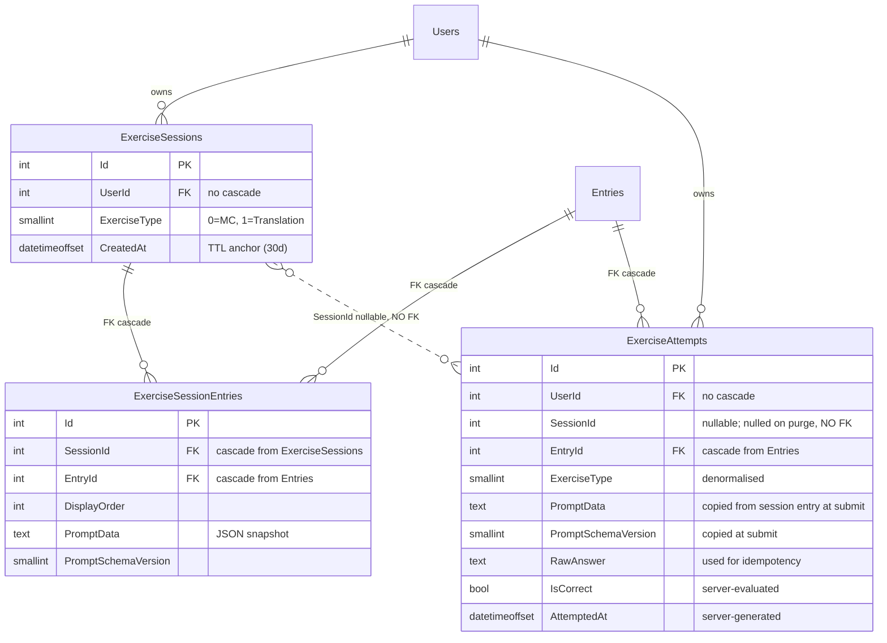
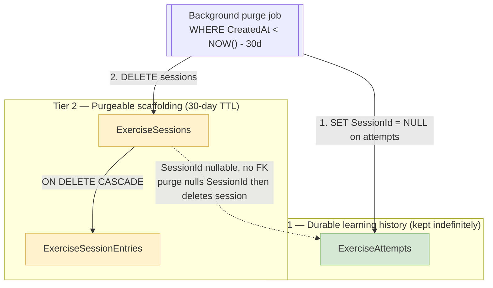
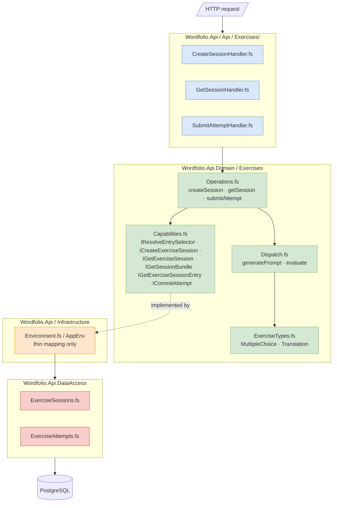
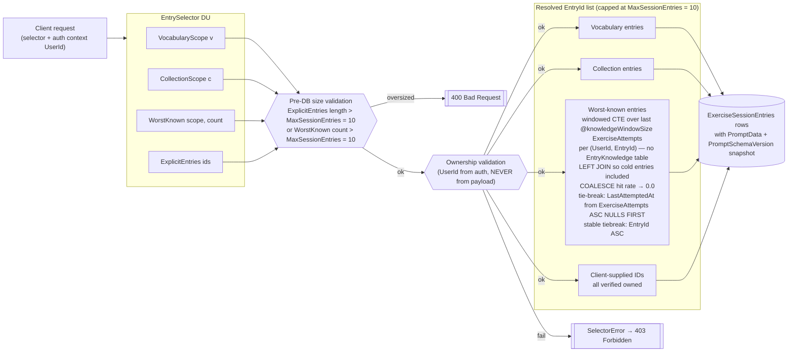
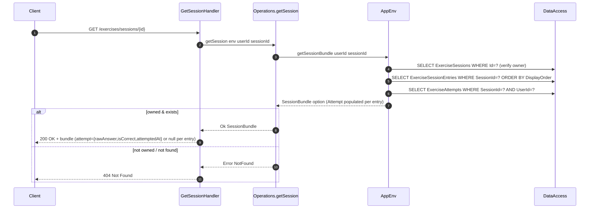
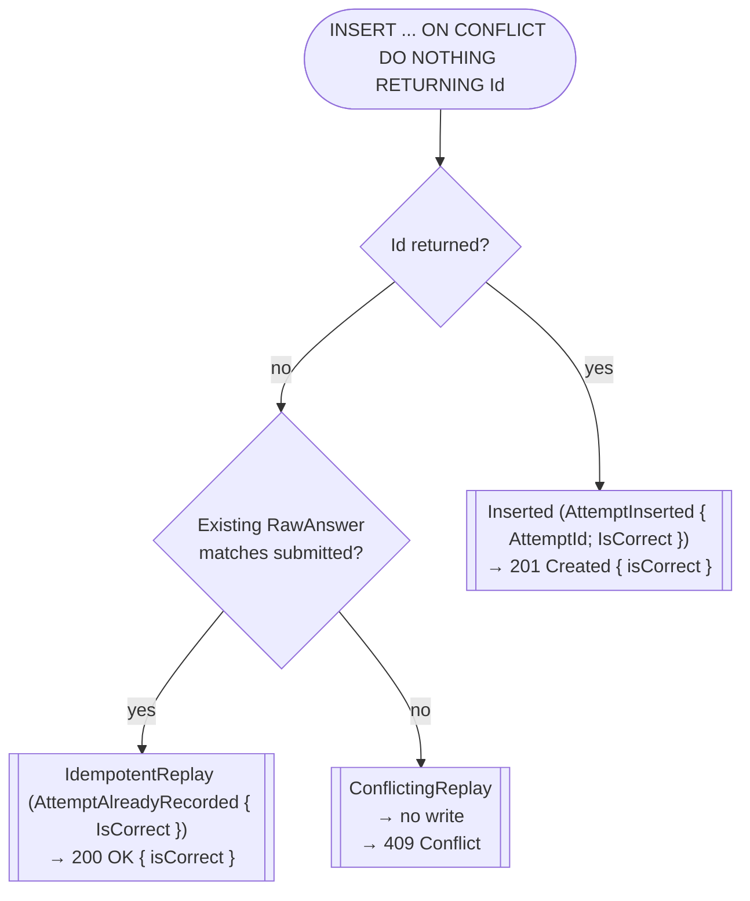
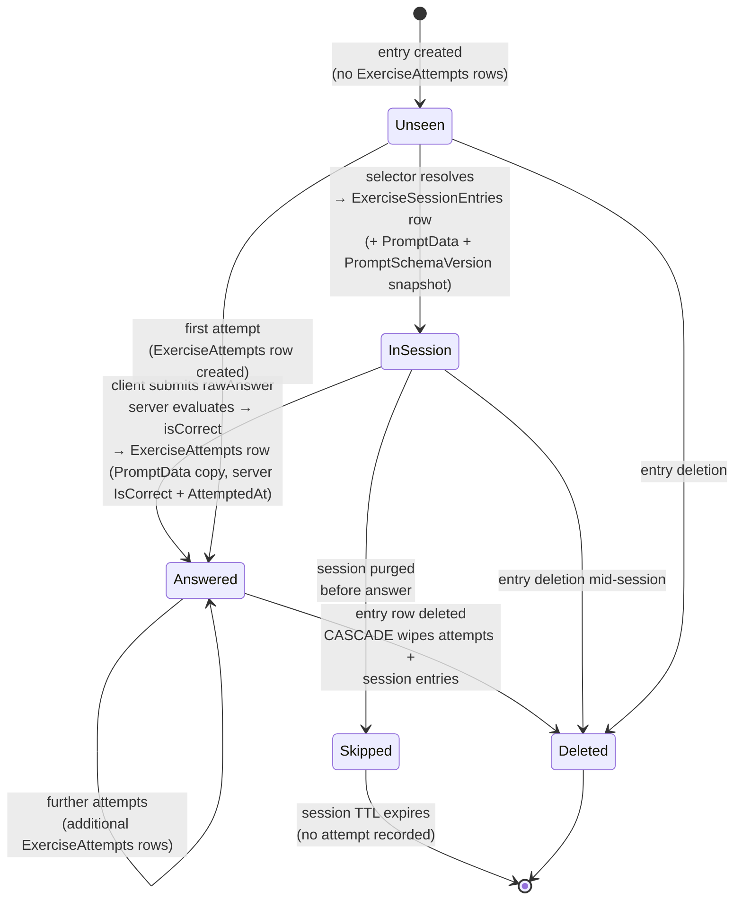

# Exercise Feature – Diagrams

Visual reference for the exercise feature design. All diagrams use Mermaid; they render inline on GitHub and in any Mermaid-aware previewer.

---

## 1. Entity-relationship model

Shows the three tables, their columns, and — crucially — which relationships are hard FKs (with cascade) versus plain indexed columns. The retention tier of each table is noted in the entity label.



Key rules encoded above:

- `EntryId` cascades everywhere — deleting an entry wipes all related history (this is the user’s intent).
- `ExerciseAttempts.SessionId` is **nullable** and carries **no FK**. The purge job nulls it before deleting the session row so attempt history survives.
- `ExerciseAttempts.PromptData` is copied from `ExerciseSessionEntries` at submit time — prompt context survives session purge without a separate durable table.
- `ExerciseAttempts.IsCorrect` is server-evaluated; the client does not supply it.
- `ExerciseAttempts.AttemptedAt` is server-generated; the client does not supply it.
- No `EntryKnowledge` table; all knowledge metrics are derived from `ExerciseAttempts` at query time.
- No `Status` / `CompletedAt` on `ExerciseSessions`: sessions are age-purged scaffolding.

---

## 2. Retention tiers

Two retention tiers with opposite policies. The diagram highlights why the FK graph is shaped the way it is.



---

## 3. Layered architecture and dispatch

The module layering follows the project-wide pattern (Handlers → Operations → Capabilities → AppEnv → DataAccess). `Dispatch.fs` is a pure DU pattern-match used by `Operations.createSession` (for `generatePrompt`) and by `Operations.submitAttempt` (for `evaluate`).



---

## 4. Selector resolution

Selectors express **intent**, not entry IDs. Resolution happens once at session creation, with oversize selectors rejected at the handler (pre-DB `400 Bad Request` for `ExplicitEntries` > `MaxSessionEntries` or `WorstKnown count` > `MaxSessionEntries`), ownership validated for requests that pass size validation, and the resulting list (capped at `MaxSessionEntries = 10`) is frozen into `ExerciseSessionEntries`.



---

## 5. Flow — Create session

`POST /exercises/sessions`. Returns the **full session bundle** with `attempt = null` for each entry.

```mermaid
sequenceDiagram
    autonumber
    participant C as Client
    participant H as CreateSessionHandler
    participant O as Operations.createSession
    participant E as AppEnv
    participant DA as DataAccess
    participant D as Dispatch

    C->>H: POST /exercises/sessions {exerciseType, selector}
    H->>H: Pre-DB size validation (400 if oversized)
    H->>O: createSession env params (UserId from auth)

    O->>E: resolveEntrySelector userId selector
    E->>DA: SELECT entries + ownership check
    DA-->>E: EntryId list
    E-->>O: Ok entryIds  /  Error SelectorError

    Note over O: Validate non-empty; cap at MaxSessionEntries = 10

    O->>DA: batch load all Entries WHERE Id IN (...)
    DA-->>O: Entry list

    loop for each entry
        O->>D: Dispatch.generatePrompt exerciseType entry
        D-->>O: GeneratedPrompt { PromptData; PromptSchemaVersion }
    end

    O->>E: createExerciseSession (CreateExerciseSessionData { ... })
    E->>DA: BEGIN TX
    E->>DA: INSERT ExerciseSessions → SessionId
    E->>DA: INSERT ExerciseSessionEntries (batch, with PromptData + PromptSchemaVersion)
    E->>DA: COMMIT
    E-->>O: SessionBundle (all attempts = None)

    O-->>H: Ok SessionBundle
    H-->>C: 201 Created + full bundle<br/>(sessionId, exerciseType, entries[] with attempt=null)
```

---

## 6. Flow — Resume / reload session

`GET /exercises/sessions/{id}`. Returns the bundle with per-entry `attempt` metadata populated.



---

## 7. Flow — Submit attempt (server-side evaluation)

`POST /exercises/sessions/{id}/entries/{entryId}/attempts`. The client sends only `rawAnswer`; the server evaluates correctness using `Dispatch.evaluate` and returns `isCorrect` in the response.

```mermaid
sequenceDiagram
    autonumber
    participant C as Client
    participant H as SubmitAttemptHandler
    participant O as Operations.submitAttempt
    participant E as AppEnv
    participant DA as DataAccess
    participant D as Dispatch

    C->>H: POST .../attempts {rawAnswer}
    H->>O: submitAttempt env userId sessionId entryId rawAnswer now

    O->>E: getExerciseSession sessionId
    E->>DA: SELECT ExerciseSessions WHERE Id=?
    E-->>O: ExerciseSession (or 404)

    O->>E: getExerciseSessionEntry sessionId entryId
    E->>DA: SELECT ExerciseSessionEntries WHERE SessionId=? AND EntryId=?
    E-->>O: ExerciseSessionEntry with PromptData + PromptSchemaVersion (or 404)

    O->>D: Dispatch.evaluate exerciseType promptSchemaVersion promptData rawAnswer
    D-->>O: Result<bool, EvaluateError>

    alt Ok isCorrect
        O->>E: commitAttempt (CommitAttemptData with server-computed IsCorrect + AttemptedAt=now)
        E->>DA: BEGIN TX
        E->>DA: INSERT ExerciseAttempts ... ON CONFLICT (SessionId, EntryId) DO NOTHING RETURNING Id
        Note over E,DA: Includes PromptData, PromptSchemaVersion, IsCorrect (server), AttemptedAt (server)

        alt Id returned (new row)
            E->>DA: COMMIT
            E-->>O: Inserted (AttemptInserted { AttemptId; IsCorrect })
            O-->>H: Ok (AttemptInserted { ... })
            H-->>C: 201 Created { "isCorrect": <bool> }
        else no Id (conflict)
            E->>DA: SELECT RawAnswer WHERE (SessionId, EntryId)
            alt RawAnswer matches
                E->>DA: COMMIT (no write)
                E-->>O: IdempotentReplay (AttemptAlreadyRecorded { IsCorrect })
                O-->>H: Ok (AttemptAlreadyRecorded { ... })
                H-->>C: 200 OK { "isCorrect": <bool> }
            else RawAnswer differs
                E->>DA: COMMIT (no write)
                E-->>O: ConflictingReplay
                O-->>H: Error ConflictingAttempt
                H-->>C: 409 Conflict
            end
        end
    else Error EvaluateError
        O-->>H: Error EvaluateError
        H-->>C: 500 Internal Server Error
    end
```

---

## 8. Idempotency decision tree

Distilled view of how `RawAnswer` resolves replays. Comparing `IsCorrect` alone cannot distinguish "same wrong answer" from "different wrong answer" — `RawAnswer` is what makes the check unambiguous.



---

## 9. Lifecycle state of a single entry

How one `EntryId` moves through the system over its lifetime. Notice that `ExerciseAttempts` is the sole source of knowledge metrics; there is no `EntryKnowledge` table. Entry deletion cascades through every tier.


