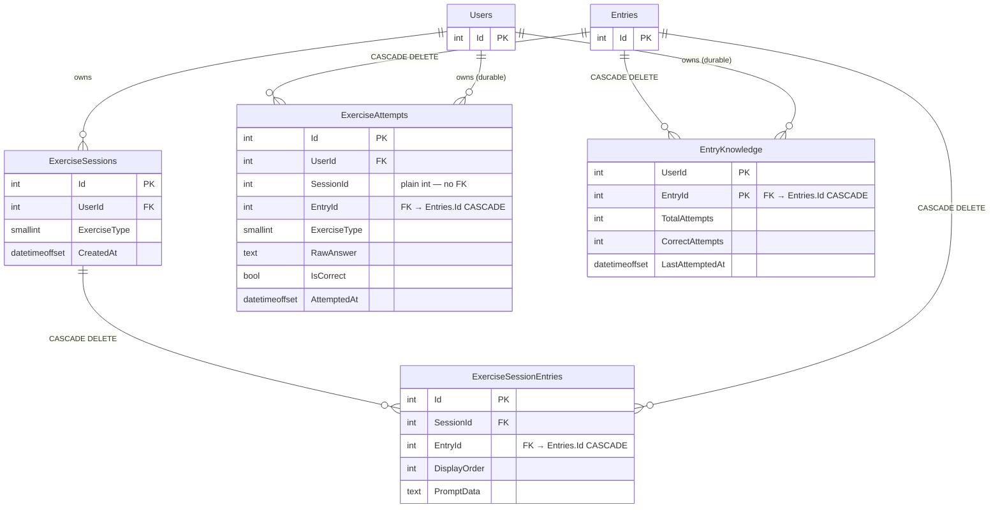
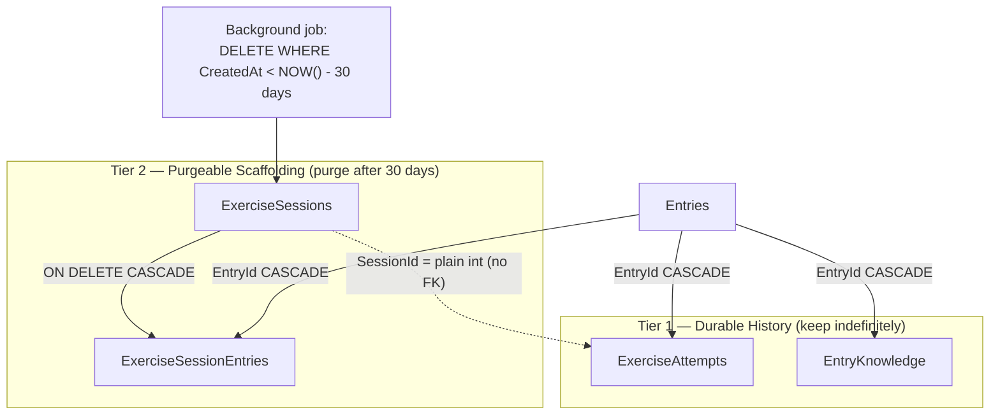
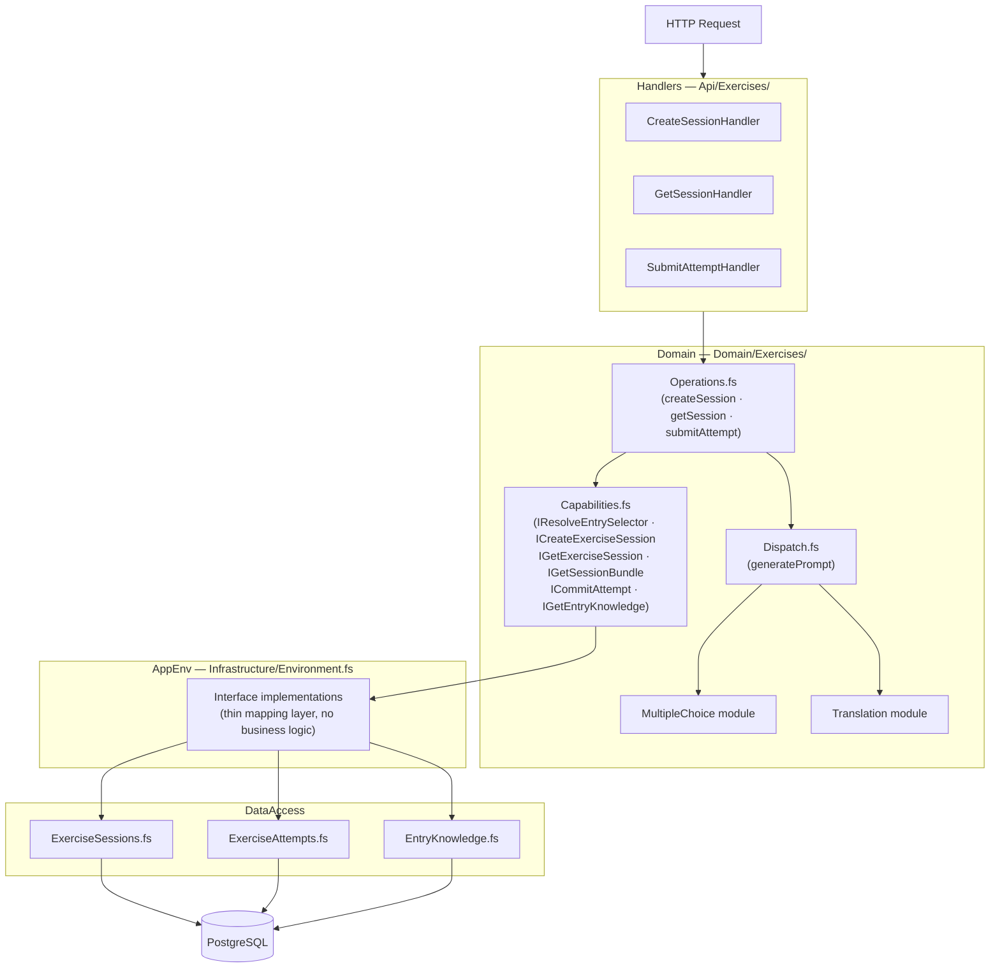
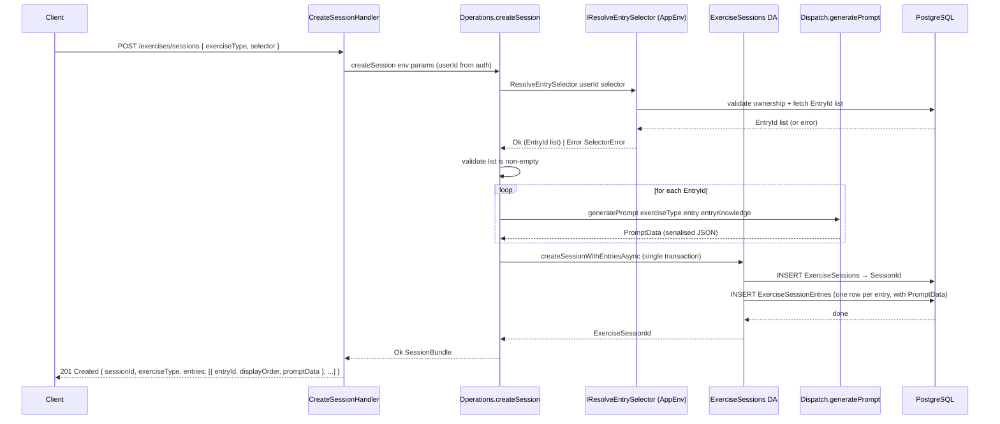
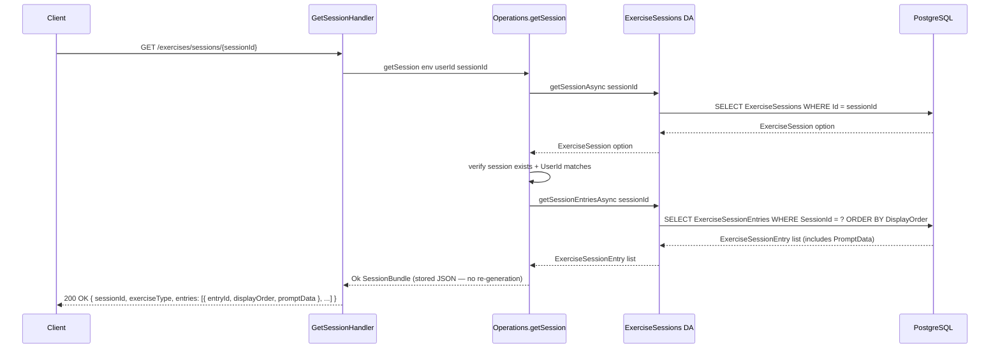
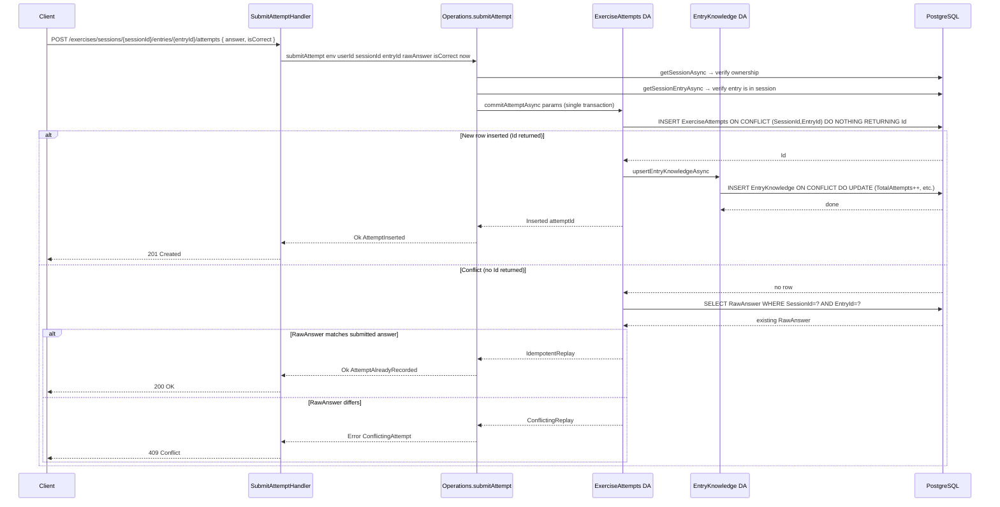
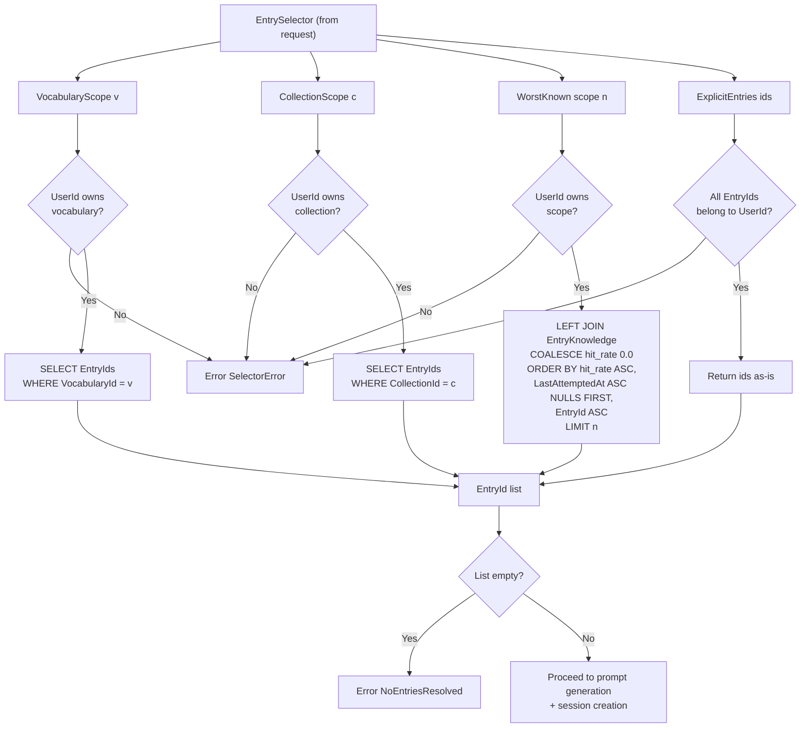

# Exercise Feature – Visual Diagrams

---

## 1. Database Schema (ER Diagram)

> **FK notes:** `ExerciseAttempts.SessionId` is a plain indexed `int` with no FK to `ExerciseSessions` — session purge does not cascade-delete attempt history. `ExerciseSessionEntries.EntryId`, `ExerciseAttempts.EntryId`, and `EntryKnowledge.EntryId` carry hard FKs to `Entries.Id ON DELETE CASCADE` — deleting an entry removes all associated session context, attempt history, and knowledge counters.

---

## 2. Data Retention Tiers

---

## 3. Layered Architecture

---

## 4. Flow 1 — Create Session

---

## 5. Flow 2 — Resume Session

---

## 6. Flow 3 — Submit Attempt (with idempotency)

---

## 7. Entry Selector Resolution

